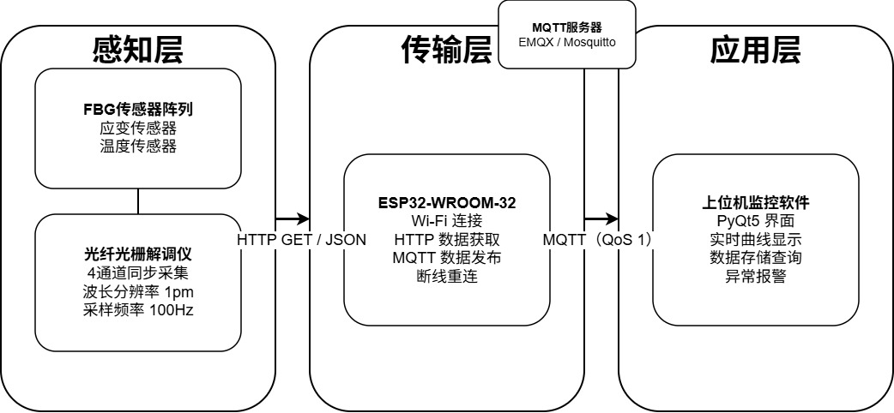
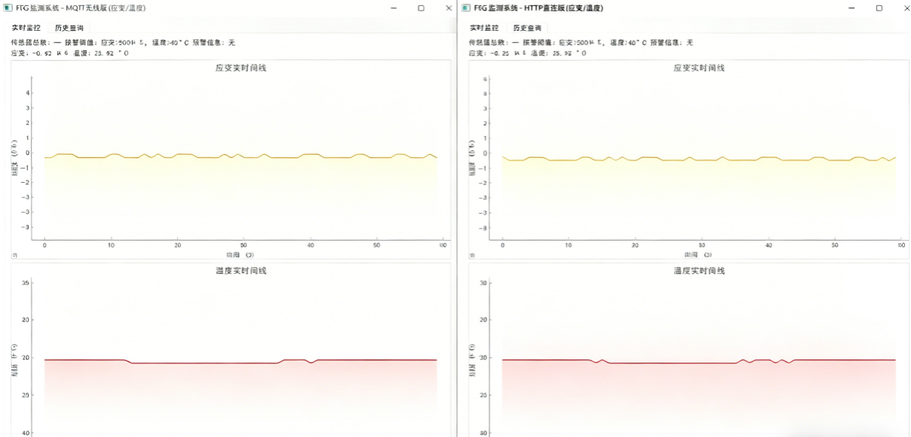
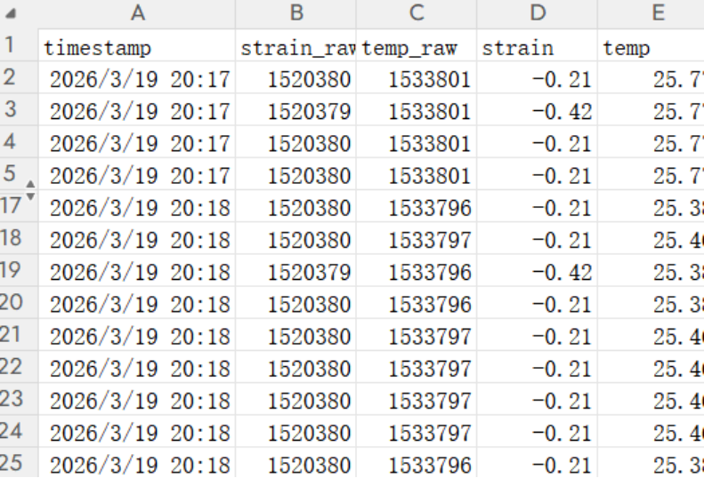

# FBG 无线监测系统

基于 **ESP32 + PyQt5 + MQTT** 的光纤光栅（FBG）传感器无线监测系统。

## 项目简介

针对传统光纤光栅（FBG）监测系统有线传输部署成本高、灵活性差、现场监控能力不足的问题，设计并实现了一套基于光纤光栅解调仪的无线通信系统与上位机监控界面。系统采用“感知层—传输层—应用层”三层架构，实现从传感器数据采集、无线传输到上位机可视化显示的完整链路。

## 技术栈

- **嵌入式端**：ESP32、Arduino、Wi-Fi、HTTP、MQTT
- **上位机端**：Python、PyQt5、多线程、pyqtgraph
- **通信协议**：MQTT（QoS 1）、HTTP/JSON

## 系统架构

## 上位机界面

## 实时曲线显示

## 核心功能

- ✅ ESP32 通过 HTTP 获取解调仪数据，经 MQTT 协议无线发布
- ✅ PyQt5 上位机订阅 MQTT 主题，实时解析并显示传感器数据
- ✅ 多通道动态曲线绘制，支持缩放与平移交互
- ✅ CSV 格式数据自动存储，支持历史数据查询与导出
- ✅ 多阈值异常报警（界面闪烁 + 日志记录）
- ✅ 断线重连机制，保障系统长期稳定运行

## 测试指标

| 指标 | 结果 |
|------|------|
| 连续运行 | 24小时无断连 |
| 数据丢包率 | 0.011% |
| 端到端延迟 | 平均 120ms |
| 刷新频率 | 10Hz |

